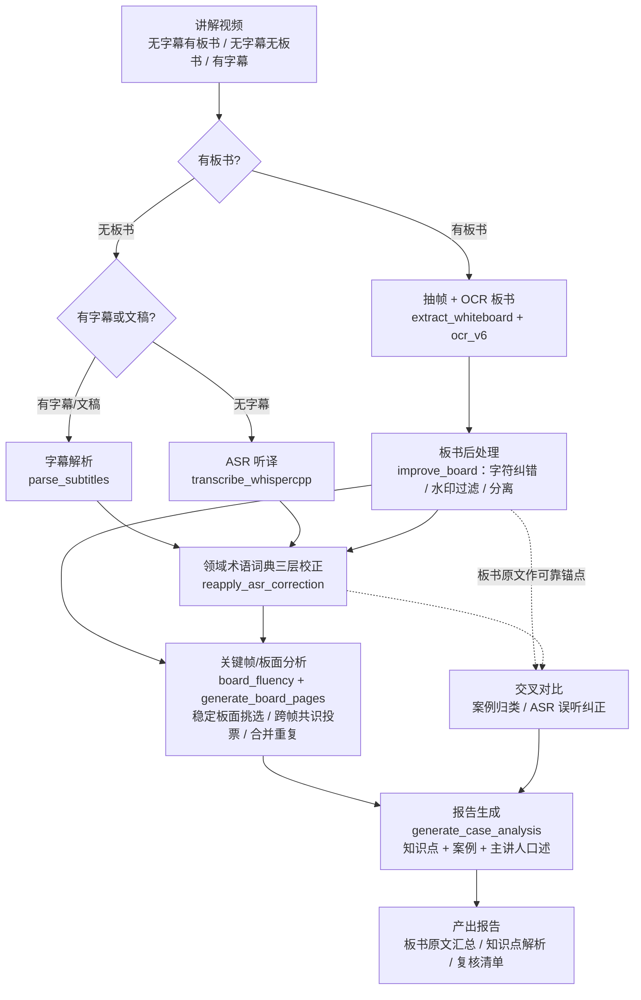

# 讲解视频内容提取框架（VideoCourseAI）

[](LICENSE)
[](requirements.txt)
[](https://github.com/DeeLiuSol/video-course-ai/pulls)

面向**讲解/教学/直播视频**的一站式内容提取框架：从视频中自动提取**板书文字（OCR）**、**语音听译（ASR）**、**字幕/文稿解析**，并用**领域术语词典**做校正，产出结构化报告。

已实际用于命理课程（八字取财方式讲解），同一框架可扩展到中医、法律、金融等任何领域的讲解/直播视频。

---

## 项目定位：AI Skill 的内容地基

本项目是**讲解类视频 → 可检索知识**的内容提取层，是构建领域 AI Skill（如"某课程问答助手"）的**前置基础**：

```
┌────────────────────────────────────────────┐
│  SKILL 层（上层建筑）                        │
│  SKILL.md + references/ + 检索问答          │  ← 内容地基够大后封装
├────────────────────────────────────────────┤
│  蒸馏层                                     │
│  报告 → 结构化 reference 模块               │  ← 中间过渡层
│  topics.md / cases.md / terms.md           │
├────────────────────────────────────────────┤
│  内容提取层（本项目）✅                      │
│  板书原文 + 听译 + 知识点 + 案例 + 主讲口述   │  ← 你现在在这里
└────────────────────────────────────────────┘
```

**逻辑**：
1. **Skill 的价值上限 = 内容基座的质量**——先铺地基，Skill 才有真货可答；低质量内容做的 Skill 没有意义
2. **提取层独立可复用**——本项目不只服务 Skill，本身是通用"讲解视频→结构化知识"框架（命理/中医/法律/金融皆可）
3. **有反馈闭环**——Skill 被问多的方向，反推需要再提取哪些视频/主题，地基越用越厚

## 能力矩阵（支持 4 种视频形态）

| 视频形态 | 处理方式 | 关键产出 |
|---------|---------|---------|
| **无字幕 + 有板书** | 板书 OCR + 语音 ASR 听译 | 板书原文 + 听译文本 + 术语校正 |
| **无字幕 + 无板书** | 纯语音 ASR 听译 | 听译文本 + 术语校正 |
| **有字幕** | 直接解析已有字幕（跳过 ASR） | 字幕文本 + 术语校正 |
| **有原始听译文稿** | 文稿直接作为文本源 / 词典参考 | 结构化文本 + 术语词典反哺 |

> 核心优势：**领域术语词典三层校正**——whisper 等通用 ASR 对专业术语（命理/中医/法律）天生识别弱，本框架用词典驱动纠错大幅提升准确率。

## 架构总览

```
┌──────────────┐   ┌──────────────────┐   ┌─────────────────────┐
│  输入视频      │   │  内容提取层        │   │  词典校正层           │
│  无字幕有板书   │──▶│  ├ 抽帧+OCR(板书)  │──▶│  V1 精确映射          │
│  无字幕无板书   │   │  ├ ASR 听译(语音)  │   │  V2 上下文规则        │
│  有字幕/文稿   │   │  └ 字幕/文稿解析   │   │  V3 组合术语          │
└──────────────┘   └──────────────────┘   └─────────────────────┘
                                              │
                              ┌───────────────┴──────────────┐
                              ▼                              ▼
                    ┌──────────────────┐            ┌──────────────────┐
                    │  关键帧分析       │            │  报告生成         │
                    │  稳定板面挑选      │            │  知识点+案例       │
                    │  跨帧共识投票      │            │  +主讲人口述      │
                    └──────────────────┘            └──────────────────┘
```

## 工作流程图



## 完整处理步骤

| 步骤 | 做什么 | 脚本 | 产出 |
|------|--------|------|------|
| 0 准备 | 视频、领域词典（glossary.json，无则按 `glossary.schema.json` 建） | — | 输入就绪 |
| 1 抽帧 | 1fps 抽帧 + pHash 去重，识别板书帧 | `extract_whiteboard.py` | `whiteboard_data.json` |
| 2 板书后处理 | OCR 字符纠错 / 水印过滤 / 板书-非板书分离 / 断行修复 | `improve_board.py` | `whiteboard_data_improved.json` |
| 3 文本源 | **有板书+无字幕**：ASR 听译；**有字幕/文稿**：`parse_subtitles.py` 解析 | `transcribe_whispercpp.py` / `parse_subtitles.py` | `transcript_segments.json` |
| 4 词典校正 | V1 精确 + V2 上下文 + V3 组合 三层术语校正 | `reapply_asr_correction.py` | `text_v3` 校正后文本 |
| 5 关键帧分析 | 稳定板面挑选 / 跨帧共识投票修正 OCR 认错 / 合并重复 / 噪声过滤 | `board_fluency_check.py` + `generate_board_pages.py` | 分页板书原文 + 复核清单 |
| 6 交叉对比 | 板书原文参照 → 案例主题归类、ASR 误听纠正 | `generate_case_analysis.py` | 案例正确归属 |
| 7 报告生成 | 知识点详解 + 案例 + 主讲人口述 | `generate_case_analysis.py` | `板书知识点解析.md` |
| 8 质检 | 对照复核清单，人工确认低置信项 | — | 可交付报告 |

## 使用方法（场景化）

### 场景 A：无字幕 + 有板书（教学/直播课，含案例图）

**最完整路径**——OCR 板书 + ASR 听译 + 案例解析：

```bash
V=示例
OUT="D:/video-skill-output/<课程>/"
# 1-2 抽帧 + 板书后处理
cd "<视频目录>" && OCR_V6_TIER=small python extract_whiteboard.py "./<视频>.mp4" --output "$OUT/whiteboard" --min-gap 10 --diff-threshold 8 --keep-frames
python improve_board.py "$OUT/whiteboard/whiteboard_data.json" --output "$OUT/whiteboard/whiteboard_data_improved.json" --frames "$OUT/whiteboard/frames"
# 3-4 ASR 听译 + 词典校正
python transcribe_whispercpp.py "$OUT/audio.wav" --glossary glossary.json --model large-v3-turbo --output "$OUT/asr_output" --threads 8
python reapply_asr_correction.py "$OUT/asr_output" --glossary glossary.json
# 5-7 关键帧分析 + 报告
python board_fluency_check.py "$V" --fix
python generate_board_pages.py "$V"
python generate_case_analysis.py --wb-dir "$OUT/whiteboard" --asr-dir "$OUT/asr_output" --rename-map rename_map.json
```

### 场景 B：无字幕 + 无板书（纯口播/讲座）

**跳过板书步骤**——只做 ASR 听译 + 词典校正：

```bash
python transcribe_whispercpp.py "$OUT/audio.wav" --glossary glossary.json --model large-v3-turbo --output "$OUT/asr_output" --threads 8
python reapply_asr_correction.py "$OUT/asr_output" --glossary glossary.json
# 产出校正后文本 transcript_segments.json（text_v3）
```

### 场景 C：有字幕/文稿（无板书，素材自带字幕）

**无需 ASR**——直接解析字幕 + 词典校正：

```bash
python parse_subtitles.py --subtitle video.srt --output "$OUT/asr_output" --glossary glossary.json
```

> 三条路径统一产出标准 `transcript_segments.json`，词典校正与下游分析完全复用。**板面文字（如有）始终是交叉对比的可靠锚点**，用于案例归类与 ASR 误听纠正。

## 功能模块

| 模块 | 脚本 | 说明 |
|------|------|------|
| 视频抽帧 + OCR 板书 | `extract_whiteboard.py` + `ocr_v6.py` | pHash 去重 + PP-OCRv6 识别板书文字 |
| 板书后处理 | `improve_board.py` | OCR 字符纠错 + 水印过滤 + 板书/非板书分离 + 断行修复 |
| **语音听译（ASR）** | `transcribe_whispercpp.py` | whisper.cpp large-v3-turbo 贪心解码（不依赖 torch，AMD CPU 可用） |
| **字幕/文稿解析** | `parse_subtitles.py` | 解析已有字幕/文稿（.srt/.vtt/.ass/.txt）→ 标准分段 JSON，无需 ASR 即接入词典校正与下游分析 |
| **术语词典校正** | `reapply_asr_correction.py` | 三层校正：V1精确映射 + V2上下文规则 + V3组合术语（词典格式见 `glossary.schema.json`） |
| 关键帧/板面分析 | `board_fluency_check.py` + `generate_board_pages.py` | 稳定板面挑选 + 跨帧共识投票修正单帧 OCR 认错 + 合并重复 |
| 报告生成 | `generate_case_analysis.py` | 知识点详解 + 案例 + 主讲人口述分析（示例领域：命理） |
| 截图重命名 | `rename_assets.py` | 案例截图按内容命名 |
| 识图（可选） | `vision_qwen.py` | Qwen-VL 视觉大模型，处理板面/图表 |

## 核心特性（解决的实际问题）

1. **稳定板面挑选**：视频板面滚动/擦写的中间态（60 段）→ 用"板书完整度分数局部最高点"挑出稳定板面（6-8 页），复现人工"挑好时机截图"
2. **跨帧共识投票**：单帧 OCR 整行认错（如 `身浊灼吐` vs 正确 `身强财旺`）字符串补全救不回，用"同槽位取多数帧版本"投票纠正
3. **术语词典三层校正**：whisper 对专业术语弱，词典驱动三层校正大幅提升准确率（词典格式见 `glossary.schema.json`，领域词典自行填充）
4. **板书/非板书分离**：OCR 混入的图表/排盘数据分离，不污染正文
5. **多形态适配**：无字幕有板书（OCR+ASR）/ 无字幕无板书（纯 ASR）/ 有字幕（直接解析）/ 有文稿（作词典参考）

## 交叉对比（Cross-Reference）⭐

讲解视频里各信息源**互相关联**——主讲人口述紧扣板书、案例紧扣当前讲解主题、字幕/文稿是可靠文本源。本框架利用这种关联做交叉验证：

| 交叉对比 | 做法 | 价值 |
|---------|------|------|
| **案例 ↔ 板书主题** | 用干净板书原文构建"第X种→要点"参照表；案例按"时间窗内板行 + 主讲人口述"与参照表交叉比对，命中要点最多的主题即归属 | 案例自动归类到正确主题（替代硬编码关键词猜） |
| **板书原文 ↔ ASR 听译** | 主讲人念的多是板书原句；用板书参照做 ASR 误听纠正（如 `乱合→乱和`、`肉体→陆体`） | 大幅减少听译人工后处理 |
| **字幕/文稿 ↔ 词典** | 有字幕/文稿的视频，其文本直接作为校正源并可反哺领域词典 | 词典越用越准 |

> 核心思路：**板面文字是讲解的"可靠锚点"**，用它校准其它弱信号（ASR 误听、单帧 OCR 认错、案例归属），而不是各自孤立处理。

## 环境准备

- **依赖**：见 `requirements.txt`（OCR/报告用 `video-skill` venv，ASR 用 `whisper312` venv，勿混用）
- **领域词典**：`glossary.json` 按 `glossary.schema.json` 格式构建（命理/中医/法律各领域不同）
- **模型**：PP-OCRv6（rapidocr 自动下载）+ whisper large-v3-turbo（`transcribe_whispercpp.py` 指定）

## 目录/路径说明

- 脚本内 `OUTPUT_ROOT` / `OUTPUT_DIR` / `WB_DIR` 等硬编码了本机输出路径（`D:\video-skill-output\...`），**发布后需按你的环境调整**
- 词典 `glossary.json` 为领域专属（命理/中医/法律各有各的术语），本项目不附完整词典，格式见 `glossary.schema.json`
- 提取出的课程内容（板书/口述）属原课程版权，**请勿随代码发布**

## License

[MIT](LICENSE)
