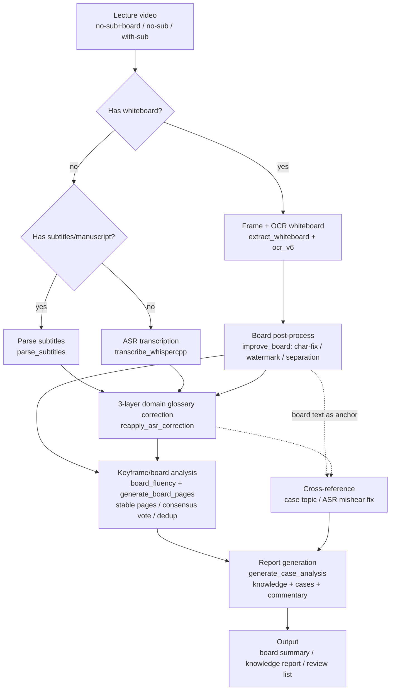

# VideoCourseAI — Structured Knowledge Extraction from Lecture Videos

[](LICENSE)
[](requirements.txt)
[](https://github.com/DeeLiuSol/video-course-ai/pulls)

> 🇨🇳 [中文版 README](README.zh-CN.md)

A one-stop content-extraction framework for **lecture / teaching / livestream videos** with **no subtitles but rich whiteboard content**. It automatically extracts **whiteboard text (OCR)**, **speech transcription (ASR)**, **existing subtitles/manuscripts**, corrects domain terminology via a **domain glossary**, and performs **keyframe/board analysis** to produce structured reports.

Already applied to Chinese metaphysics courses (Bazi wealth-method lectures); the same framework extends to **Traditional Chinese Medicine (TCM)**, law, finance, or any domain with dense professional terminology.

---

## Project Positioning: The Content Foundation for AI Skills

This project is the **content-extraction layer** that turns lecture videos into searchable knowledge — the prerequisite foundation for building domain-specific AI Skills (e.g., a "course Q&A assistant"):

```
┌────────────────────────────────────────────┐
│  SKILL Layer (upper architecture)           │
│  SKILL.md + references/ + retrieval QA      │  ← wrap after content base is large enough
├────────────────────────────────────────────┤
│  Distillation Layer                         │
│  reports → structured reference modules     │  ← intermediate layer
│  topics.md / cases.md / terms.md            │
├────────────────────────────────────────────┤
│  Content Extraction Layer (this project) ✅ │
│  board text + transcription + knowledge     │  ← you are here
│  points + cases + lecturer commentary        │
└────────────────────────────────────────────┘
```

**Rationale**:
1. **A Skill's value ceiling = the quality of its content base** — lay the foundation first; a Skill built on thin content is worthless
2. **The extraction layer is independently reusable** — a general "lecture video → structured knowledge" framework, not just a Skill feeder
3. **Feedback loop** — the topics a Skill gets asked most reveal which videos/content to extract next

## Capability Matrix (4 Video Forms)

| Video Form | Processing | Key Output |
|-----------|-----------|-----------|
| **No subtitles + whiteboard** | Whiteboard OCR + speech ASR | board text + transcript + corrected terms |
| **No subtitles + no whiteboard** | Pure speech ASR | transcript + corrected terms |
| **Has subtitles** | Parse existing subtitles (skip ASR) | subtitle text + corrected terms |
| **Has original manuscript** | Manuscript as text source / glossary reference | structured text + glossary enrichment |

> **Core strength**: **3-layer domain-glossary correction** — generic ASR (whisper etc.) is weak on domain terms (metaphysics/TCM/law); this framework drives corrections via a dictionary to dramatically improve accuracy.

## Architecture Overview

```
┌──────────────┐   ┌──────────────────┐   ┌─────────────────────┐
│   Input video │   │  Extraction layer │   │  Glossary layer     │
│   no-sub + board │──▶│  ├ frame+OCR(whiteboard) │──▶│  V1 exact mapping   │
│   no-sub + no-board │   │  ├ ASR speech           │   │  V2 context rules   │
│   sub/manuscript │   │  └ subtitle parse        │   │  V3 composite terms │
└──────────────┘   └──────────────────┘   └─────────────────────┘
                                              │
                              ┌───────────────┴──────────────┐
                              ▼                              ▼
                    ┌──────────────────┐            ┌──────────────────┐
                    │  Keyframe/Board  │            │  Report          │
                    │  analysis        │            │  knowledge+case  │
                    │  stable pages    │            │  +commentary     │
                    │  consensus vote  │            │                   │
                    └──────────────────┘            └──────────────────┘
```

## Workflow



## Pipeline Steps

| Step | What | Script | Output |
|------|------|--------|--------|
| 0 Prepare | Video, domain glossary (`glossary.json`, build per `glossary.schema.json`) | — | inputs ready |
| 1 Frame extraction | 1fps frames + pHash dedup, detect whiteboard frames | `extract_whiteboard.py` | `whiteboard_data.json` |
| 2 Board post-process | OCR char-fix / watermark filter / board-nonboard separation / line-join | `improve_board.py` | `whiteboard_data_improved.json` |
| 3 Text source | **board+no-sub**: ASR; **has-sub/manuscript**: `parse_subtitles.py` | `transcribe_whispercpp.py` / `parse_subtitles.py` | `transcript_segments.json` |
| 4 Glossary correction | V1 exact + V2 context + V3 composite | `reapply_asr_correction.py` | corrected `text_v3` |
| 5 Keyframe analysis | stable page selection / cross-frame consensus vote / dedup / noise filter | `board_fluency_check.py` + `generate_board_pages.py` | page-based board text + review list |
| 6 Cross-reference | board-text anchor → case topic, ASR mishear fix | `generate_case_analysis.py` | correct case topics |
| 7 Report | knowledge points + cases + lecturer commentary | `generate_case_analysis.py` | `knowledge-report.md` |
| 8 QA | review low-confidence items | — | deliverable report |

## Usage Scenarios

### A: No subtitles + whiteboard (teaching/live, with case images)

**Fullest path** — whiteboard OCR + ASR + case analysis:

```bash
V=example
OUT="D:/video-skill-output/<course>/"
# 1-2 frame extraction + board post-process
cd "<video-dir>" && OCR_V6_TIER=small python extract_whiteboard.py "./<video>.mp4" --output "$OUT/whiteboard" --min-gap 10 --diff-threshold 8 --keep-frames
python improve_board.py "$OUT/whiteboard/whiteboard_data.json" --output "$OUT/whiteboard/whiteboard_data_improved.json" --frames "$OUT/whiteboard/frames"
# 3-4 ASR + glossary correction
python transcribe_whispercpp.py "$OUT/audio.wav" --glossary glossary.json --model large-v3-turbo --output "$OUT/asr_output" --threads 8
python reapply_asr_correction.py "$OUT/asr_output" --glossary glossary.json
# 5-7 keyframe analysis + report
python board_fluency_check.py "$V" --fix
python generate_board_pages.py "$V"
python generate_case_analysis.py --wb-dir "$OUT/whiteboard" --asr-dir "$OUT/asr_output" --rename-map rename_map.json
```

### B: No subtitles + no whiteboard (pure talk/podcast)

**Skip board steps** — ASR + glossary correction only:

```bash
python transcribe_whispercpp.py "$OUT/audio.wav" --glossary glossary.json --model large-v3-turbo --output "$OUT/asr_output" --threads 8
python reapply_asr_correction.py "$OUT/asr_output" --glossary glossary.json
```

### C: Has subtitles/manuscript (no whiteboard)

**No ASR needed** — parse subtitles + glossary correction:

```bash
python parse_subtitles.py --subtitle video.srt --output "$OUT/asr_output" --glossary glossary.json
```

> All three paths produce the standard `transcript_segments.json`; glossary correction and downstream analysis are fully shared. **Board text (when present) is always the reliable anchor** for cross-referencing case topics and fixing ASR mishears.

## Modules

| Module | Script | Description |
|--------|--------|-------------|
| Frame + OCR whiteboard | `extract_whiteboard.py` + `ocr_v6.py` | pHash dedup + PP-OCRv6 recognition |
| Board post-process | `improve_board.py` | OCR char-fix + watermark filter + board/non-board separation + line-join |
| **Speech ASR** | `transcribe_whispercpp.py` | whisper.cpp large-v3-turbo greedy decoding (no torch, AMD-CPU friendly) |
| **Subtitle/manuscript parse** | `parse_subtitles.py` | Parse existing .srt/.vtt/.ass/.txt → standard segment JSON, plug into correction & analysis without ASR |
| **Glossary correction** | `reapply_asr_correction.py` | 3-layer: V1 exact + V2 context + V3 composite (schema: `glossary.schema.json`) |
| Keyframe/board analysis | `board_fluency_check.py` + `generate_board_pages.py` | stable page selection + cross-frame consensus vote + merge dup |
| Report | `generate_case_analysis.py` | knowledge points + cases + lecturer commentary (example domain: metaphysics) |
| Screenshot rename | `rename_assets.py` | case screenshots renamed by content |
| Vision (optional) | `vision_qwen.py` | Qwen-VL visual model |

## Core Features (Problems Solved)

1. **Stable page selection**: rolling/erasing board intermediate states (60 segments) → pick stable pages via "board completeness score local maxima" (6-8 pages) — reproduces manual "screenshot at the right moment"
2. **Cross-frame consensus voting**: a single frame's OCR whole-line misrecognition (e.g. `身浊灼吐` vs correct `身强财旺`) can't be fixed by string-similarity completion — vote "same-slot, majority-version" instead
3. **3-layer domain glossary correction**: whisper is weak on domain terms; dictionary-driven 3-layer correction greatly improves accuracy (build your own glossary per `glossary.schema.json`)
4. **Board/non-board separation**: OCR-mixed charts/tables data separated, not polluting main text
5. **4-form adaptation**: no-sub+board (OCR+ASR) / no-sub (pure ASR) / with-sub (parse) / with-manuscript (glossary reference)

## Cross-Reference ⭐

Information sources in lecture videos are **strongly correlated** — lecturer speech tracks the board, cases track the current topic, subtitles/manuscripts are reliable text. This framework cross-validates them:

| Cross-reference | Approach | Value |
|----------------|----------|-------|
| **Case ↔ board topic** | Build "topic→points" reference from clean board text; case matched by "time-window board lines + lecturer speech" against it; topic with most point-hits wins | auto-classify cases to correct topics (replaces hardcoded keyword guessing) |
| **Board ↔ ASR** | Lecturer reads board sentences; use board reference to fix ASR mishears (e.g. `乱合→乱和`, `肉体→陆体`) | greatly reduces manual post-processing |
| **Subtitle/manuscript ↔ glossary** | Videos with subtitles use them as correction source and enrich the glossary | glossary gets better over time |

> Core idea: **board text is the "reliable anchor" of the lecture** — use it to calibrate weaker signals (ASR mishears, single-frame OCR errors, case topics), instead of processing each source in isolation.

## Environment

- **Dependencies**: see `requirements.txt` (OCR/reports use the `video-skill` venv; ASR uses `whisper312` venv — do not mix)
- **Domain glossary**: build `glossary.json` per `glossary.schema.json` (different per domain: metaphysics/TCM/law)
- **Models**: PP-OCRv6 (rapidocr auto-download) + whisper large-v3-turbo (`transcribe_whispercpp.py`)

## Paths / Notes

- Scripts hardcode local output paths (`OUTPUT_ROOT` / `OUTPUT_DIR` / `WB_DIR`, e.g. `D:\video-skill-output\...`) — **adjust for your environment after cloning**
- `glossary.json` is domain-specific; this repo ships only the schema, not a full glossary
- Extracted course content (board text / transcripts) belongs to the original course copyright — **do not publish it alongside the code**

## License

[MIT](LICENSE)

---

**Technical paper** (Chinese): [docs/项目技术论文.md](docs/项目技术论文.md) · **WeChat article** (Chinese): [docs/公众号文章.md](docs/公众号文章.md)
