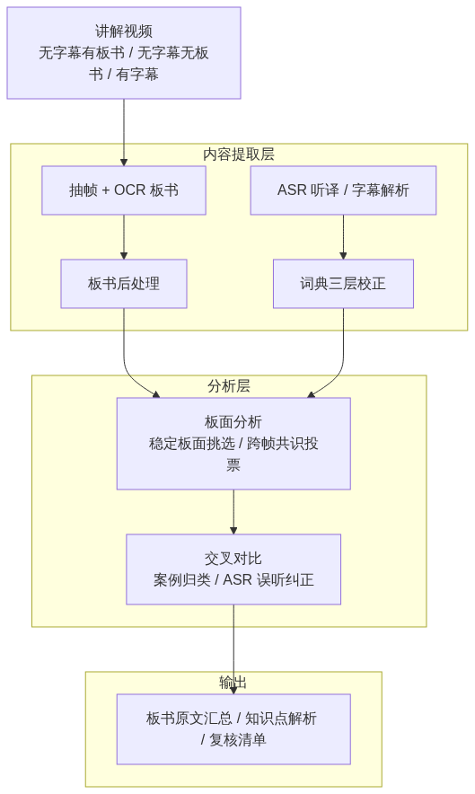
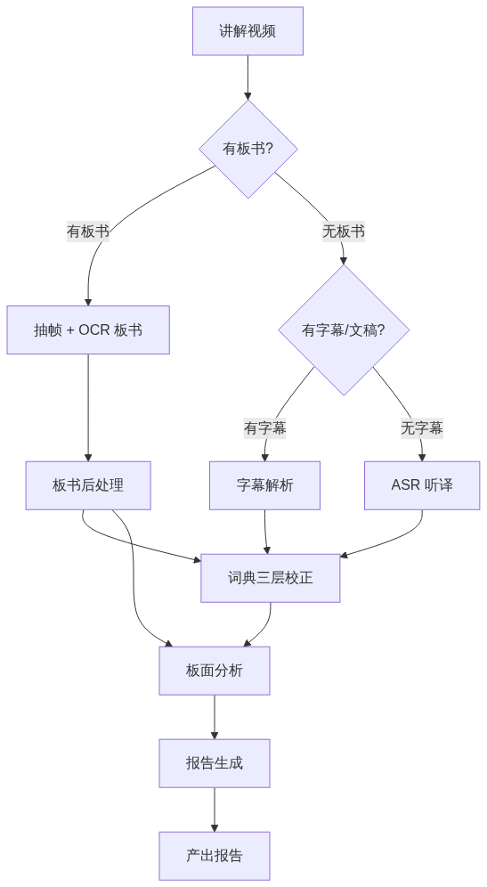
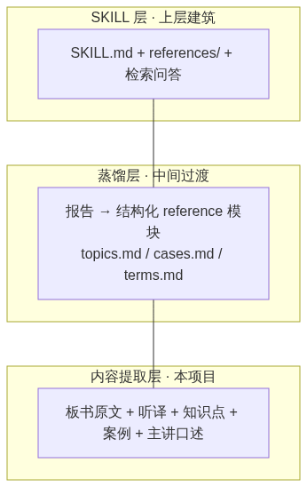

# 如何把"讲解视频"变成"可检索的知识"？——一套视频内容提取框架

> 面向无字幕、有板书的讲解/教学/直播视频，自动提取板书文字、语音听译、术语词典校正与关键帧分析，产出结构化知识。
> 本文是项目技术论文的公众号版。完整论文见文末链接。

---

## 01 为什么需要这样一套框架

大量高质量讲解视频存在三个特点：

1. **无字幕**——只能靠语音识别
2. **有板书**——知识点写在板面上，随讲解逐行累积、滚动、被覆盖
3. **专业术语密集**——命理、中医、法律等领域词汇，通用语音识别严重误听

四个核心难点：

| 难点 | 具体表现 |
|------|---------|
| 术语误听 | "驿马"被识别成"异码"，"食伤"被识别成"时尚" |
| 板面中间态 | 板面一滚动就产生一个新片段，一个知识点几十个中间态（实测 60 段） |
| 单帧 OCR 认错 | 某一行整行认错（`身浊灼吐…` 实为 `身强财旺…`），补全救不回 |
| 信息源孤立 | 板面、语音、案例各自独立，互不印证 |

## 02 方案：信息源互校 + 板面作"可靠锚点"

核心洞察：**讲解视频里，板面文字是讲解的可靠锚点**——主讲人口述紧扣板书、案例紧扣当前主题。用板面去校准其它弱信号。

## 03 四个关键设计

### 3.1 稳定板面挑选（解决中间态）

对每个分段算"板书完整度分数"（干净长行总长度），取**局部最高点**作为稳定板面。板面在讲解间隙保持完整，滚动瞬间分数低。

**效果**：60 段滚动中间态 → 8 个稳定板面。复现人工"挑好时机截图"的效果。

### 3.2 跨帧共识投票（解决单帧整行认错）

同一知识点要点在多个帧出现，正确版出现次数远多于单帧误读。把要点按"同编号+同主题"归类，对槽位内所有版本投票，取多数。

**实例**：某帧 OCR 输出 `2、身浊灼吐…`（1 帧），正确版 `2、身强财旺，且日主能够三合六合暗合住财星` 在 14 帧出现——投票自动压回正确版。

### 3.3 领域术语词典三层校正（解决术语误听）

whisper 等通用 ASR 对专业术语弱，叠加词典三层校正：
- **V1 精确映射**：误听词 → 正确词
- **V2 上下文规则**：仅特定上下文才替换，避免误伤
- **V3 组合术语**：多字符组合修复

词典为领域专属（命理版 194 条映射 + 190 条规则），中医/法律/金融各建各的，框架通用。

### 3.4 交叉对比（信息源互校）

- **案例 ↔ 板书主题**：用板书原文建参照表，案例按时间窗板行+口述交叉比对归类
- **板书 ↔ ASR 听译**：主讲人念的多是板书原句，用板书纠正 ASR 误听
- **字幕/文稿 ↔ 词典**：有字幕的视频直接解析（.srt/.vtt/.ass/.txt），文本反哺词典

## 04 实际效果（命理课程 3-1/3-2/3-3）

| 指标 | 数值 |
|------|------|
| 板书 60 段 → 稳定板面 | 8 页 |
| 黄底排盘混入正文 | 全部消除 |
| 短句截断 | 补全/拼接/共识修正 |
| 案例主题归类 | 3-2 全 21 案例、3-3 全 12 案例正确 |
| 主讲人口述 | 3-1: 25 段、3-2: 21 段、3-3: 14 段 |

## 05 与同类方案对比

| 方案 | 板书 OCR | 领域术语 | 中间态 | 单帧认错 | 信息源互校 |
|------|---------|---------|--------|---------|-----------|
| 通用 ASR 转写 | ✗ | ✗ 误听严重 | — | — | ✗ |
| 通用 OCR 工具 | ✓ 无时间轴 | 部分 | ✗ | ✗ | ✗ |
| 商用音视频转写 | ✗ | 弱 | ✗ | ✗ | ✗ |
| 人工整理 Skill | — | ✓ 成本高 | — | — | ✓ 不可扩展 |
| **本框架** | ✓ 时间轴+稳定板面 | ✓ 词典三层校正 | ✓ 60→8 | ✓ 共识投票 | ✓ 板面作锚点 |

**核心优势**：领域术语可控、板面质量自动化、信息源互校、多形态适配（无字幕有板书/无字幕无板书/有字幕/有文稿）、可扩展为领域问答 Skill 的内容地基。

## 06 未来方向

1. 批量扩展内容基座（更多视频）
2. 跨领域验证（中医师讲解视频）
3. 蒸馏层 + Skill 封装（内容够了做问答助手）
4. 接入视觉大模型（Qwen-VL）提升 OCR 边界字符

---

## 项目定位：AI Skill 的内容地基

本项目是**讲解类视频 → 可检索知识**的内容提取层，是构建领域 AI Skill 的前置基础：

**项目链接**：[github.com/DeeLiuSol/video-course-ai](https://github.com/DeeLiuSol/video-course-ai)（MIT License，欢迎 Star / Issue / PR）

---

*本文为技术论文公众号版，完整技术细节见仓库 `docs/项目技术论文.md`。*
